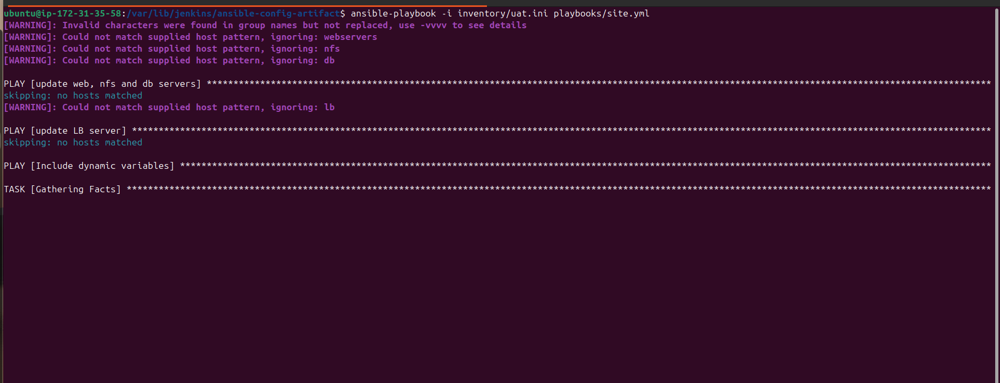

# Ansible — Dynamic Assignments (include_vars) & Community Roles

> A step-by-step, practical README for adding dynamic environment variables and consuming community roles (MySQL, Load Balancers) in the `ansible-config-mgt` repo.

**WARNING / IMPORTANT:** Ansible evolves quickly. Always cross-check module syntax and role options with the official Ansible docs and the role's README on Ansible Galaxy before running in production.

---

## Table of Contents

1. [Purpose](#purpose)
2. [Assumptions & prerequisites](#assumptions--prerequisites)
3. [Repository layout (expected)](#repository-layout-expected)
4. [Create the `dynamic-assignments` structure](#create-the-dynamic-assignments-structure)
5. [`env-vars.yml` — dynamic include_vars playbook (content)](#env-varsyml--dynamic-include_vars-playbook-content)
6. [Create per-environment variable files](#create-per-environment-variable-files)
7. [Update `playbooks/site.yml` to include dynamic assignments](#update-playbookssiteyml-to-include-dynamic-assignments)
8. [Using community roles (example: geerlingguy.mysql)](#using-community-roles-example-geerlingguymysql)
9. [Load-balancer roles (Nginx vs Apache) — pattern and toggles](#load-balancer-roles-nginx-vs-apache---pattern-and-toggles)
10. [Git / Branch / PR workflow](#git--branch--pr-workflow)
11. [Testing & running playbooks per environment](#testing--running-playbooks-per-environment)
12. [Troubleshooting & tips](#troubleshooting--tips)
13. [Extras & recommended next steps](#extras--recommended-next-steps)

---

## 1. Purpose

This README explains how to:

* Add dynamic environment-specific variables that are included at runtime using `include_vars` (the dynamic variant).
* Use community (Ansible Galaxy) roles to avoid re-inventing well-tested tasks (example: MySQL role by `geerlingguy`).
* Add conditional load-balancer roles (nginx vs apache) and choose them using environment variables.

All instructions assume you will keep the repository in GitHub and perform installs on your Jenkins-Ansible server (or your control node).

---

## 2. Assumptions & prerequisites

* You have Ansible installed (recommended >= 2.9, but check compatibility with your chosen roles). If you use Ansible 2.8+ you should prefer `include_vars`, `include_tasks`, `include_role` etc.
* `git` installed and configured on your control node.
* Access to the GitHub repository: `https://github.com/<your-name>/ansible-config-mgt.git`.
* Optional: `ansible-galaxy` CLI available to install roles.
* Inventory files for your environments (dev/stage/uat/prod).

---

## 3. Repository layout (expected)

```
ansible-config-mgt/
├── dynamic-assignments/
│   └── env-vars.yml            # playbook to include env-specific vars (runtime)
├── env-vars/
│   ├── dev.yml
│   ├── stage.yml
│   ├── uat.yml
│   └── prod.yml
├── inventory/
│   ├── dev
│   ├── stage
│   ├── uat
│   └── prod
├── playbooks/
│   └── site.yml
├── static-assignments/
│   ├── common.yml
│   ├── webservers.yml
│   └── loadbalancers.yml
└── roles/                      # (optional) managed roles; roles installed here by ansible-galaxy
    └── mysql/
```

> Note: If you previously used `ansible-galaxy init` locally and didn't push `roles/` to GitHub, consider committing the roles directory (or maintaining a `requirements.yml`) to keep your repo reproducible.

---

## 4. Create the `dynamic-assignments` structure

On your local machine or the Jenkins control node (where you run playbooks):

```bash
# clone your repo and create branch
git clone https://github.com/<your-name>/ansible-config-mgt.git
cd ansible-config-mgt
git checkout -b dynamic-assignments

# create folders
mkdir -p dynamic-assignments env-vars playbooks static-assignments inventory roles

# create the dynamic file
cat > dynamic-assignments/env-vars.yml <<'YAML'
---
- name: collate variables from env specific file, if it exists
  hosts: all
  tasks:
    - name: looping through list of available files
      include_vars: "{{ item }}"
      with_first_found:
        - files:
            - dev.yml
            - stage.yml
            - prod.yml
            - uat.yml
          paths:
            - "{{ playbook_dir }}/../env-vars"
      tags:
        - always
YAML

# add and commit (keep working commits small)
git add dynamic-assignments/env-vars.yml
git commit -m "Add dynamic env-vars include playbook"
```

---

## 5. `env-vars.yml` — dynamic include_vars playbook (content)

The `env-vars.yml` should look exactly like the content above. Important notes:

* `include_vars` reads variable files at runtime.
* `with_first_found` scans the `files` list and picks the first file found in the `paths` list — this lets us set defaults or have environment-specific overrides.
* `playbook_dir` is used so the task can find files relative to the playbook path no matter where you run `ansible-playbook` from.

---

## 6. Create per-environment variable files

Create files under `env-vars/` for every environment. Example minimal `uat.yml`:

```yaml
# env-vars/uat.yml
# variables specific to UAT
enable_nginx_lb: true
enable_apache_lb: false
load_balancer_is_required: true
mysql_root_password: secure_root_password_here
mysql_database: tooling_db
mysql_user: tooling
mysql_password: tooling_pass
```

Create `dev.yml`, `stage.yml`, `prod.yml` similarly. Include any environment-specific IPs, hostnames, credentials, or toggles here.

**Security note:** Store sensitive secrets securely. Consider using Ansible Vault or an external secret store; do not store production passwords in plaintext in GitHub.

---

## 7. Update `playbooks/site.yml` to include dynamic assignments

Open `playbooks/site.yml` and update to include the dynamic playbook before other imports. Example:

```yaml
---
- hosts: all
  name: Include dynamic variables
  tasks:
    - import_playbook: ../static-assignments/common.yml
    - include: ../dynamic-assignments/env-vars.yml
  tags:
    - always

- hosts: webservers
  name: Webserver assignment
  import_playbook: ../static-assignments/webservers.yml

- hosts: lb
  name: Loadbalancers assignment
  import_playbook: ../static-assignments/loadbalancers.yml
```

**Important:** As of Ansible 2.8+, the `include` top-level usage is deprecated in favor of proper `import_playbook` / `include_role` / `include_tasks` / `include_vars`. The example follows your project guidance but always review warnings when you run `ansible-playbook` and update accordingly.

---

## 8. Using community roles (example: geerlingguy.mysql)

### Why community roles?

They are reusable, tested, and configurable. `geerlingguy.mysql` is a well-known role for installing and configuring MySQL/MariaDB.

### Steps to add the role on your Jenkins-Ansible control node

```bash
# inside your repo on the control node
cd ansible-config-mgt

# create a feature branch for roles
git checkout -b roles-feature

# install the role from Ansible Galaxy
ansible-galaxy install geerlingguy.mysql

# rename or move the role folder if you want a simpler name (optional)
mv ~/.ansible/roles/geerlingguy.mysql/ roles/mysql || true
# OR if ansible-galaxy installed into ./roles, keep as-is and update references

# read the role README (locally) and copy/update defaults/main.yml with the environment-specific values
```

Alternatively, track role installs with a `requirements.yml` (recommended):

```yaml
# requirements.yml
- src: geerlingguy.mysql
  name: mysql
```

Install via:

```bash
ansible-galaxy install -r requirements.yml -p roles/
```

### Configure the role

Edit role variables either in `roles/mysql/defaults/main.yml`, in `env-vars/<env>.yml`, or pass them as extra vars. Example variables (check role README for exact names):

```yaml
# env-vars/uat.yml
mysql_root_password: "secure_root_pass"
mysql_databases:
  - name: tooling_db
mysql_users:
  - name: tooling
    host: "%"
    password: "tooling_pass"
    priv: "tooling_db.*:ALL"
```

### Add role to a play (static or in an assignments playbook)

`static-assignments/database.yml` (example):

```yaml
- hosts: db
  roles:
    - role: mysql
```

Commit changes and push the branch:

```bash
git add roles requirements.yml env-vars
git commit -m "Add mysql role and env var config"
git push --set-upstream origin roles-feature
```

Create a Pull Request and merge when validated.

---

## 9. Load-balancer roles (Nginx vs Apache) — pattern and toggles

You want to support *either* Nginx *or* Apache in a given environment. Use role defaults and environment toggles.

### Role defaults (in each role)

`roles/nginx/defaults/main.yml`

```yaml
enable_nginx_lb: false
load_balancer_is_required: false
```

`roles/apache/defaults/main.yml`

```yaml
enable_apache_lb: false
load_balancer_is_required: false
```

### `static-assignments/loadbalancers.yml`

```yaml
- hosts: lb
  roles:
    - { role: nginx, when: enable_nginx_lb and load_balancer_is_required }
    - { role: apache, when: enable_apache_lb and load_balancer_is_required }
```

### Toggle in `env-vars/uat.yml`

```yaml
load_balancer_is_required: true
enable_nginx_lb: true
enable_apache_lb: false
```

This keeps logic centralized: the playbook always imports `loadbalancers.yml`, but the role execution only happens when the environment toggles allow it.

---

## 10. Git / Branch / PR workflow

Recommended lightweight workflow (used in the project description):

```bash
# Create a feature branch
git checkout -b dynamic-assignments
# Make edits, commit small changes
git add .
git commit -m "Add dynamic env-vars and site update"
# Push branch
git push --set-upstream origin dynamic-assignments
# Open PR on GitHub, review, merge to main
```

When adding roles, use `roles-feature` branch as in the instructions, and create a PR with a clear title and description.

---

## 11. Testing & running playbooks per environment

Run playbooks against an inventory file for an environment. Examples:

```bash
# Run against UAT (assumes inventory/uat exists or is a file)
ansible-playbook -i inventory/uat playbooks/site.yml

# If inventory files are directories, use the correct path or set ANSIBLE_INVENTORY
ansible-playbook -i inventory/uat/hosts.ini playbooks/site.yml
```

What to expect:

* `env-vars.yml` will include variables from `env-vars/uat.yml` (or whichever file is first-found)
* Role tasks will read variables available in the host scope

If you want a dry-run (no changes):

```bash
ansible-playbook -i inventory/uat playbooks/site.yml --check
```

---

## 12. Troubleshooting & tips

* **Ansible deprecation warnings:** If `ansible-playbook` warns that `include` is deprecated, refactor to `import_playbook` or `include_tasks`/`include_role`/`include_vars` where appropriate.
* **Paths & `playbook_dir` issues:** `{{ playbook_dir }}` refers to the directory of the top-level playbook being executed; make sure relative paths are correct when calling nested playbooks.
* **Variable precedence:** `include_vars` adds variables to the host scope. If you need host- or group-specific variable precedence, prefer inventory group_vars/host_vars or higher-precedence mechanisms.
* **Sensitive data:** Use Ansible Vault for passwords and private keys. Do not push secrets into GitHub.
* **Role versions:** Pin roles in `requirements.yml` to avoid surprises when Galaxy updates a role.
* **Testing:** Start by running the role tasks against a disposable VM or a container-based environment (Vagrant/LXC) before running on prod/UAT.

---

## 13. Extras & recommended next steps

* Add a `requirements.yml` to pin external roles and commit it.
* Add CI checks: e.g., a GitHub Actions job or Jenkins pipeline that runs `ansible-lint` and a `--syntax-check` on changed playbooks.
* Use Ansible Vault for secrets and add instructions for vault editing to this README.
* Add `README` in `roles/mysql/` describing which env-vars are required and where to set them.

---

## Quick reference: useful commands

```bash
# Install role from galaxy (global or local roles/)
ansible-galaxy install -r requirements.yml -p roles/

# Run playbook for specific inventory
ansible-playbook -i inventory/uat.ini playbooks/site.yml

 !

# Dry run
ansible-playbook -i inventory/uat playbooks/site.yml --check

# Init a git branch
git checkout -b roles-feature
```

---

If you want, I can also:

* generate a `requirements.yml` pinned to specific versions for the roles you choose,
* add an example `static-assignments/database.yml` and `static-assignments/webservers.yml`, or
* produce a short Jenkins pipeline to automatically `ansible-galaxy install -r requirements.yml` and run tests.

Happy to extend this README into docs, examples, or CI — tell me which next step you want.
